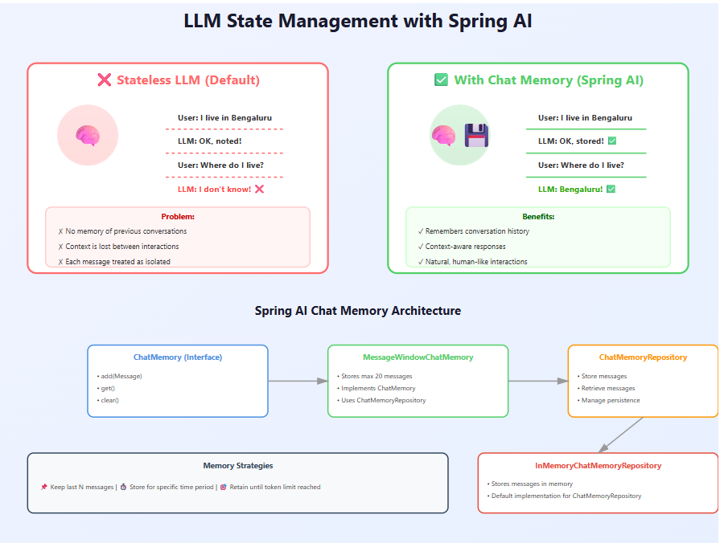

# Spring AI

## Messages

#### System Message
* A message of the type 'system' passed as input. 
* This role typically provides high-level instructions for the conversation. 
* For example, you might use a system message to instruct the generative to behave like a certain character or to provide answers in a specific format.
#### User Message
* A message of the type 'user' passed as input Messages with the user role are from the end-user or developer. 
* They represent questions, prompts, or any input that you want the generative to respond to
#### Assistant Message
* Lets the generative know the content was generated as a response to the user. 
* This role indicates messages that the generative has previously generated in the conversation. 
* Message from the LLM Modal that is going to consider as Assistant Message  
#### ToolResponse Message / Functional Message 
* The ToolResponseMessage class represents a message with a function content in a chat application.

## Defaults
* DefaultChatClientBuilder is a builder class for creating a ChatClient.
  It provides methods to set default values for various properties of the ChatClient.
* `defaultSystem(), defaultUser(), defaultAdvisior()`

## Prompt Templates

* Using the prompt templates makes prompt construction easy.
* Makes Prompt reusable and maintainable
* Keeps the logic and the prompts cleanly seperated.
* It supports parameterized placeHolders
* Prompt templates can be store in `.st` file under resource folder
* Using `@Value()` providing path of the .st file 

`    @Value("classpath:/promptTemplates/userPromptTemplate.st")
    Resource userPromptTemplate;`

## Prompt Stuffing
* It is used only when we are feeding limited number of data to LLM.
* In case if we have 100 or 200 pages of information in that case prompt stuffing will face some issues.
### What are issues with Prompt Stuffing with unlimited data ?
* Limitations of LLM Models (https://developers.openai.com/api/docs/models) Based on the modal being used if the input tokens increase greater than context window or if the output token is greater than max tokens gives an error.
* **Billing** All the requests sending to LLM model are not free until unless you have your own LLM Model deployed locally by using models like Ollama   
  * All the LLM Models charges based on the number of tokens that you are trying to consume.
  * **Billing is = Input Tokens + OutPut Tokens**

### What is token ?
* LLM can only understand the number but not plain Language 
* To check how Tokens are generated visit the website (https://platform.openai.com/tokenizer)
* A one token is generally corresponds to ~4 characters of the text for common english text

### Advisors
* In Spring AI Advisors are like middleware or interceptors for your prompt flow.
* Advisors helps in pre-processing and post-processing the prompt data.
* It helps to add custom logging and inject additional behavior without modifying core intention of the prompt
* Advisors can be chained

    **User -> Chat Client -> [Advisors] -> LLM -> Response -> [Advisors] -> User**

* Some of the builtin Advisors are
  * SafeGuardAdvisor
  * SimpleLoggerAdvisor ... Custom Advisor
* Any Advisors can implement CallAdvisor or StreamAdvisor or both depending upon the call
  * Call Advisor : resulting in a call to an AI model
  * Stream Advisor : streaming call to an AI mode
* Every Advisor will have a variable called **order**. Which helps for which advisor should execute.
  * Advisor with high order number will execute first 
  * if both advisors have same order number it depends on how advisors from the chatClient
  

  Example of the Advise Call from Simple Logger Advisor

    ```java
    @Override
    public ChatClientResponse adviseCall(ChatClientRequest chatClientRequest, CallAdvisorChain callAdvisorChain) {
        //Logging the Request
        logRequest(chatClientRequest); //logging the request

        /**
            If any more advisors need to called that is possible with callAdvisorChaining
        **/
        ChatClientResponse chatClientResponse = callAdvisorChain.nextCall(chatClientRequest); 

        //Logging the response
        logResponse(chatClientResponse);
        
        return chatClientResponse;
    } 
    ```

#### Best Practice
* Keep advisor as a stateless
* if require chain the multiple advisors.
* Don't modify the meaning of the prompt.
* Use Advisors for cross-cutting concerns not core logic

### Chat Options 
* Chat options are configurable in Spring AI
* It allows to customize hoe a LM behaves during chat/completion calls.
* With the help of chatOptions you can set limits,adjust creativity, control response and so on
* By default, Spring AI provides some key chat options at ```ChatOptions.java```
* Model Specific Chat Options for example for Ollama chat model there is ```OllamaChatOptions.java``` and model has its own options.
``` java
ChatOptions chatOptions = ChatOptions.builder().model("llama3.2:1b")
        .maxTokens(100).temperature(0.8).build();
        
```

### Chat Memory
* By default LLM's are stateless
* What is state less ? 
  * LLM won't remember the conversation for example if i tell LLM i am leaving in bengaluru. then next if i as ask where i am leaving LLM will no idea where i am leaving.
* To remember Spring AI provides a chat memory to store and manage the conversations.
* These messages are stored using ChatMemoryRepository.
* There are various memories strategies
  * Keep last N messages
  * Store message for specific time 
  * Retain the message till the token limit is reached.
* With Chat Memory LLM can behave more like a human, remembering the past to improve the response.
```java
    MessageWindowChatMemory implements ChatMemory Interface
    MessageWindowChatMemory has a ChatMemoryRepositry (I) 
    InMemoryChatMemoryRepository implements ChatMemoryRepository
```
* By default MessageWindowChatMemory Stores Max of 20 Messages
* 
* Now the Question of how the Chat Client will remember ?
  * Advisors is used to manage how memory is stored and reused across multiple interactions.
  * Built In Advisors
    * MessageChatMemoryAdvisor
    * PromptChatMemoryAdvisor
    * VectorStoreMemoryAdvisor
    * When to use what
    
    | AdvisorType | Format | Use Case |
    |--|--|--| 
    |MessageChatMemoryAdvisor|Structured Message | Real-time Chat Memory|
    |PromptChatMemoryAdvisor|Plain text|Token-optimized Conversation|
    |VectorStoreMemoryAdvisor|Semantic Match|Long-term chats|
  
* By default, Chat Memory has default CONVERSATION_ID with "chat_memory_conversation_id"
* Issue with this is if there is any application where multiple users are accessing the application. There might be a chance that Chat Memory might be updated with a new set of data.
* So to solve this for example we can set a CONVERSATION_ID as the userName that can pass in the headers refer ```ChatMemoryController.java```
* The problem with InMemoryChatMemoryRepository is Once the application restarts all the conversation is lost to overcome we can use database to store the conversations
* Use JdbcChatMemoryRepository is a built-in implementation that uses JDBC to store messages in a relational
  database. It supports multiple databases out-of-the-box and is suitable for applications that require
  persistent storage of chat memory.